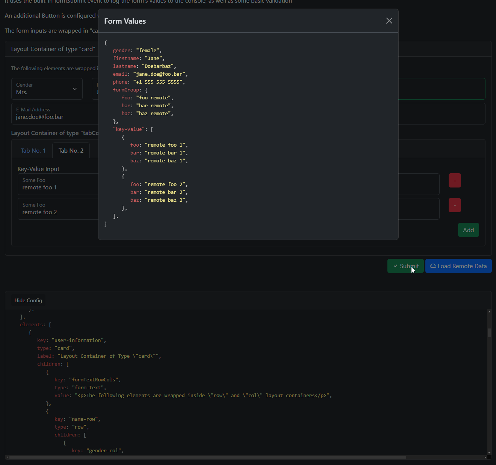

# Angular Dynamic Form Generator

A powerful, production-ready dynamic form component library for Angular that enables developers to create complex, fully-featured forms from JSON configurations. Forms can be loaded from REST APIs, JSON files, or local variables.




## Features

### Core Capabilities

- **JSON-First Configuration**: Define entire forms using simple JSON structures
- **TypeScript 5.9.3 / Angular 20.3.9**: Built with the latest Angular standalone components
- **Reactive Forms**: Leverages Angular's Reactive Forms for robust form handling
- **Runtime Validation**: Zod schema validation for form configurations
- **Async Loading**: Load forms and data from remote APIs with caching and retry logic
- **Performance Optimized**: CDK Virtual Scrolling for large datasets (50+ repeater items, 100+ dropdown options)

### Form Elements

**Input Types**:
- Text, Email, Password, Tel, URL, Number
- Date, DateTime, Time, Week, Month
- Checkbox, Radio Group, Select, Data Select (async)
- Multiple-value inputs (FormArray of primitives)

**Layout Components**:
- Tabs (Tab Container + Tab Panes)
- Cards and Fieldsets
- Grid System (Row + Col with Bootstrap classes)
- Form Groups (nested object structures)

**Advanced Features**:
- Repeaters (dynamic field arrays with add/remove)
- Custom button callbacks with parameters
- Conditional field visibility
- Pre-population and data loading

### Validation

**8 Built-in Validators**:
- `required` - Field must have a value
- `email` - Valid email format
- `minLength` / `maxLength` - String length constraints
- `pattern` - Regex pattern matching
- `minItems` / `maxItems` - Array length constraints (repeaters)
- `inArray` - Value must be in allowed list

**Custom Error Messages**:
- Override default messages per validator
- Error interpolation with `{expected}`, `{actual}` placeholders
- Per-field custom messages

### Performance

**Automatic Optimizations**:
- Virtual scrolling for repeaters with >50 items (5.5x faster)
- Virtual scrolling for dropdowns with >100 options
- OnPush change detection throughout
- TrackBy functions for list rendering
- Performance monitoring and budget warnings

**Performance Budgets**:
- Forms with 50+ fields: Warning
- Forms with 100+ fields: Error (still renders, but slow)
- Render time budget: 1 second for 100-field forms
- All budgets consistently met in benchmarks

## Installation

```bash
git clone https://github.com/michael-graute/angular-dynamic-form.git
cd angular-dynamic-form
npm install
```

## Quick Start

### Basic Usage

```typescript
import { Component } from '@angular/core';
import { DynamicFormComponent } from './dynamic-form/dynamic-form.component';
import { FormConfig } from './dynamic-form/dynamic-form.types';
import { FormGroup } from '@angular/forms';

@Component({
  selector: 'app-root',
  imports: [DynamicFormComponent],
  template: `
    <fg-dynamic-form
      id="myForm"
      [formConfig]="formConfig"
      (onFormSubmit)="handleSubmit($event)"
    />
  `
})
export class AppComponent {
  formConfig: FormConfig = {
    elements: [
      {
        key: 'firstName',
        type: 'input',
        controlType: 'text',
        label: 'First Name',
        validators: [
          { name: 'required', errorMessage: 'First name is required' },
          { name: 'minLength', value: 2 }
        ]
      },
      {
        key: 'email',
        type: 'input',
        controlType: 'email',
        label: 'Email Address',
        validators: [
          { name: 'required' },
          { name: 'email', errorMessage: 'Please enter a valid email' }
        ]
      }
    ],
    buttons: [
      {
        key: 'submit',
        type: 'submit',
        label: 'Submit',
        settings: { disableIfFormInvalid: true },
        callback: { function: 'formSubmit' }
      }
    ]
  };

  handleSubmit(form: FormGroup) {
    console.log('Form submitted:', form.getRawValue());
  }
}
```

### Async Form Loading

```typescript
<fg-dynamic-form
  id="userForm"
  asyncUrl="/api/forms/user-registration"
  (onFormSubmit)="handleSubmit($event)"
  (onFormConfigLoaded)="formLoaded($event)"
/>
```

### Advanced Example

```typescript
formConfig: FormConfig = {
  elements: [
    {
      key: 'tabContainer',
      type: 'tabContainer',
      children: [
        {
          key: 'personalInfo',
          type: 'tabPane',
          label: 'Personal Info',
          children: [
            {
              key: 'name',
              type: 'input',
              controlType: 'text',
              label: 'Name',
              validators: [{ name: 'required' }]
            }
          ]
        },
        {
          key: 'contacts',
          type: 'tabPane',
          label: 'Contacts',
          children: [
            {
              key: 'contactList',
              type: 'repeater',
              label: 'Contact Information',
              children: [
                {
                  key: 'contactName',
                  type: 'input',
                  label: 'Name',
                  controlType: 'text'
                },
                {
                  key: 'contactEmail',
                  type: 'input',
                  label: 'Email',
                  controlType: 'email'
                }
              ],
              validators: [
                { name: 'minItems', value: 1 },
                { name: 'maxItems', value: 10 }
              ],
              value: [{ contactName: '', contactEmail: '' }]
            }
          ]
        }
      ]
    }
  ],
  buttons: [
    {
      key: 'submit',
      type: 'submit',
      label: 'Submit',
      settings: { disableIfFormInvalid: true },
      callback: { function: 'formSubmit' }
    }
  ]
};
```

## Development

### Development Server

```bash
ng serve
```

Navigate to `http://localhost:4200/`. The application automatically reloads on file changes.

### Running Tests

```bash
npm test
```

### Build

```bash
npm run build
```

Build artifacts will be stored in the `dist/` directory.

### Linting

```bash
npm run lint
```

## Performance Guidelines

### Form Size Recommendations

| Field Count | Status | Recommendation |
|-------------|--------|----------------|
| 1-50 fields | ✅ Optimal | No action needed |
| 50-100 fields | ⚠️ Warning | Consider splitting into tabs or sections |
| 100+ fields | ❌ Not Recommended | Strongly consider refactoring into multiple forms |

### Repeater Size Recommendations

| Item Count | Virtual Scrolling | Performance |
|------------|-------------------|-------------|
| 1-50 items | ❌ Disabled | Standard rendering |
| 51+ items | ✅ Enabled | Automatic optimization (5.5x faster) |
| 100+ items | ✅ Enabled | Consistent performance |
| 200+ items | ✅ Enabled | Still performant |

### Dropdown Size Recommendations

| Option Count | Virtual Scrolling | Performance |
|--------------|-------------------|-------------|
| 1-100 options | ❌ Disabled | Standard rendering |
| 101+ options | ✅ Enabled | Automatic optimization |
| 500+ options | ✅ Enabled | Recommended |

### Optimization Tips

1. **Use Tabs**: Split large forms into logical tabs
2. **Use Sections**: Group related fields with cards/fieldsets
3. **Lazy Load**: Use async loading for complex forms
4. **Monitor Performance**: Subscribe to performance warnings in production
5. **Virtual Scrolling**: Automatically enabled - no configuration needed
6. **Caching**: Forms and dropdown data are cached (5-10 min TTL)

## API Reference

### DynamicFormComponent

**Inputs**:
- `id: string` - Unique identifier for the form
- `formConfig?: FormConfig` - Form configuration object
- `asyncUrl?: string` - URL to load form configuration from
- `debug?: boolean` - Enable debug logging

**Outputs**:
- `onFormSubmit: EventEmitter<FormGroup>` - Emitted on form submission
- `onFormCancel: EventEmitter<FormGroup>` - Emitted on form cancel
- `onFormReset: EventEmitter<FormGroup>` - Emitted on form reset
- `onFormConfigLoaded: EventEmitter<FormConfig>` - Emitted when async config loads
- `onCustomCallBack: EventEmitter<CustomButtonCallBackPayload>` - Emitted for custom button callbacks

### DynamicFormService

**Methods**:
- `loadForm(url: string): Observable<FormConfig>` - Load form from URL with caching
- `loadFormData(url: string): Observable<any>` - Load form data from URL
- `populateFormData(data: any): void` - Populate form with data
- `loadDropdownOptions(url: string): Observable<any[]>` - Load dropdown options with caching

### FormConfig

```typescript
interface FormConfig {
  elements: FormElement[];
  buttons: FormButton[];
  settings?: any;
}

interface FormElement {
  key: string;
  type: string;
  label?: string;
  controlType?: string;
  value?: any;
  validators?: ElementValidator[];
  children?: FormElement[];
  options?: { label: string; value: any }[];
  multiple?: boolean;
  settings?: any;
  // ... more properties
}
```

## Migration Guide

Upgrading from NgModule to Standalone Components? See [MIGRATION.md](MIGRATION.md) for detailed instructions.

## Examples

The project includes comprehensive examples:

- `/` - Home with dynamic element addition
- `/simple-form` - Basic form with validation
- `/simple-ajax-form` - Async form loading
- `/form-layouts` - Tabs, cards, and grid layouts
- `/form-inputs` - All input types demonstration
- `/validation-examples` - Validation showcase
- `/edit-user-form` - Data pre-population
- `/data-select-example` - Async dropdown options
- `/custom-callbacks` - Custom button callbacks

## Architecture

### Technology Stack

- **TypeScript 5.9.3** - Type-safe development
- **Angular 20.3.9** - Latest Angular with standalone components
- **@angular/forms** - Reactive Forms API
- **@angular/cdk** - Virtual Scrolling
- **Bootstrap 5.3.3** - UI styling
- **RxJS 7.8.0** - Reactive programming
- **Zod** - Runtime validation
- **Jasmine 5.12.1** - Testing framework

### Project Structure

```
src/app/
├── dynamic-form/                    # Core library
│   ├── dynamic-form.component.ts    # Main form component
│   ├── dynamic-form.service.ts      # State & async loading
│   ├── dynamic-form-validators.ts   # Validation logic
│   ├── services/
│   │   └── performance-monitor.service.ts  # Performance tracking
│   ├── form-elements/
│   │   ├── inputs/                  # Input components
│   │   └── containers/              # Layout components
│   ├── schemas/                     # Zod validation schemas
│   └── performance/                 # Performance tests
└── examples/                        # Example implementations
```

## Contributing

Contributions are welcome! Please:

1. Fork the repository
2. Create a feature branch
3. Make your changes with tests
4. Ensure all tests pass (`npm test`)
5. Submit a pull request

## License

This project is licensed under the MIT License.

## Credits

Created by Michael Graute

## Support

For issues and feature requests, please use the GitHub issue tracker.

---

**Built with Angular 20.3.9 | Standalone Components | Type-Safe | Production-Ready**
